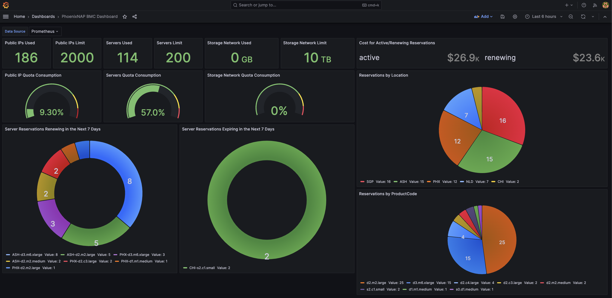

# prometheus-phoenixnap-bmc-exporter



## Developing

1. Install development tooling

    ```bash
    brew bundle
    go mod tidy
    ```

2. Build the image

    ```bash
    docker compose build
    ```

3. Create a configuration file at `~/.pnap/config.yaml`:

    ```yaml
    clientId: super-secret-redacted-uuid-here
    clientSecret: super-secret-redacted-uuid-here
    tokenUrl: https://auth.phoenixnap.com/auth/realms/BMC/protocol/openid-connect/token
    log:
        level: trace
        format: json
    ```

4. Launch a local environment.

    ```bash
    docker compose up
    ```

    Links:
    | Service | Url | Description |
    | -- | -- | -- |
    | grafana | http://localhost:3000 | Grafana Dashboard is hosted here.  Username: `admin`, Password: `grafana` |
    | prometheus | http://localost:9090 | Prometheus scrapes every 15 seconds. |
    | exporter | http://localhost:9150/metrics | PhoenixNAP BMC exporter. |