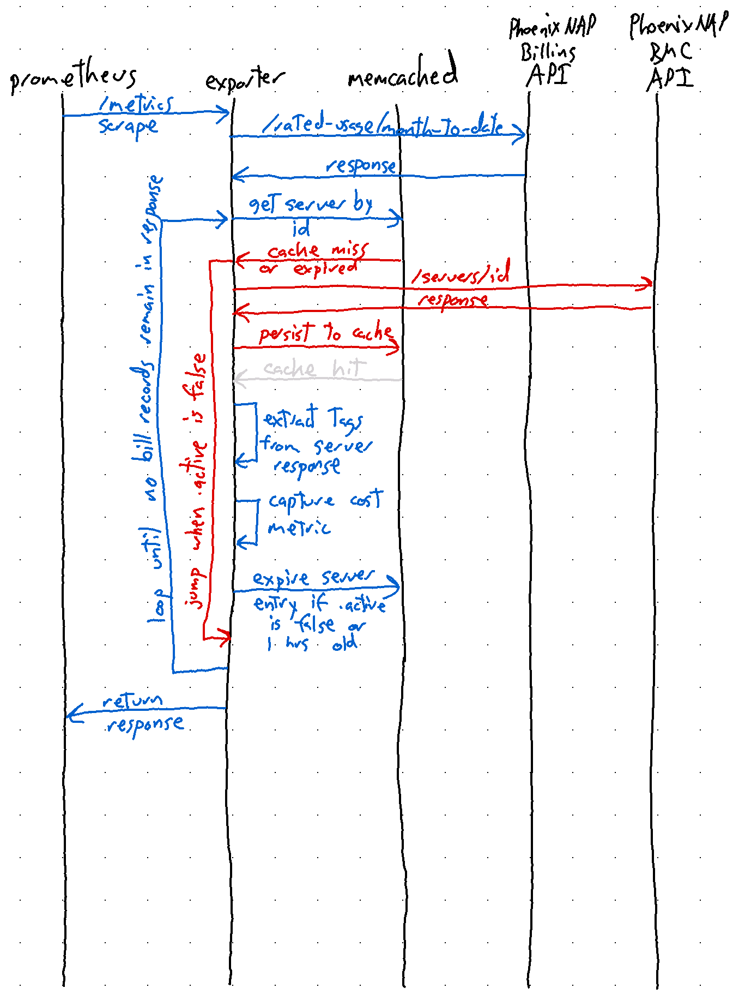

# 6. Design for Billing Data Export

Date: 2023-07-07

## Status

In Progress

## Context

As a user of the PhoenixNAP BMC, I want to be able to track my Server costs by Billing
Tags so that I can allocate costs by cost center and visualize these costs over
time.

The PhoenixNAP BMC provides two APIs for retrieving Billing Cost Data:

- [GET /rated-usage/month-to-date](https://developers.phoenixnap.com/docs/bmc-billing/1/routes/rated-usage/month-to-date/get)
- [GET /rated-usage](https://developers.phoenixnap.com/docs/bmc-billing/1/routes/rated-usage/get)


The `GET /rated-usage` allows for requesting a custom billing period using a from
month and a to month as parameters.  In contrast, the `GET /rated-usage/month-to-date`
provides a better interface to the billing API from an exporter perspective
because it only returns data for the current month.

The output of the `GET /rated-usage/month-to-date` API looked like this at the
time of writing:

```json
[
  ...,
  {
    "metadata": {
      "id": "649c98e2fba71a1dad477173",
      "hostname": "machine.example.com"
    },
    "id": "b0aed2af-2923-4d97-9b05-8c923f681176",
    "productCategory": "bmc-server",
    "productCode": "d2.c2.medium",
    "location": "CHI",
    "yearMonth": "2023-07",
    "startDateTime": "2023-07-01T00:00:00Z",
    "endDateTime": "2023-07-07T15:00:07.7Z",
    "cost": 10400,
    "costBeforeDiscount": null,
    "costDescription": null,
    "priceModel": "hourly",
    "unitPrice": 0.65000,
    "unitPriceDescription": "hour",
    "quantity": 160,
    "active": true,
    "usageSessionId": "3eed4c65-05c3-4b97-8d11-c7844a2602bd",
    "correlationId": "3eed4c65-05c3-4b97-8d11-c7844a2602bd",
    "reservationId": null,
    "discountDetails": null
  },
  ...,
]
```

Every month a new billing record is created for each server and its cost count
starts from zero.  The key pieces of data that will be consumed by the expoorter
are:

| Field Name | Used as a label | Used for control logic |
| -- | -- | -- |
| .metadata.hostname | `true` | `false` |
| .metadata.id | `false` | `true` |
| .productCategory | `true`  | `false` |
| .productCode | `true` | `false` |
| .location | `true` | `false` |
| .priceModel | `true` | `false` |
| .active | `false` | `true` |

Currently, the billing API does not provide the billing tags.  To retrieve the
tags, we need to request this from the []() API.
When `.active` is `true`, the tags and other information can be retrieved via 
the [GET /servers/{serverId}](https://developers.phoenixnap.com/docs/bmc/1/routes/servers/%7BserverId%7D/get)
API.  When `.active` is false, the tag information cannot be retrieved.  For
this reason, the exporter will only export metrics for active servers.  It will
be up to prometheus to store historical data for deleted BMC Servers.  To enable
the exporter to record a final metric when a server is no longer active, memcached
will be used to temporarily cache the server record in memory.



## Decision

- Add memcached to the deployment stack for the exporter.
- Add logic to collect and process the `GET /rated-usage/month-to-date` API response into metrics.
- Add logic to allow for the caching of PhoenixNAP BMC API Server records in memcached.
- Extend the existing dashboard to graph cost metrics over time.

## Consequences

- Exporter is no longer stateless and must maintain state in the
  memcached container to facilitate accurate cost metrics reporting.
